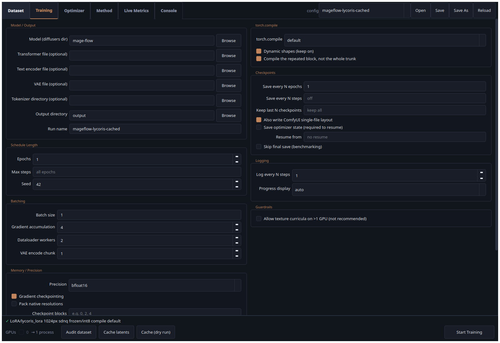

# Mage-Flow trainer

Train Mage-Flow adapters or finetune the full transformer through the GUI or CLI, with native model weights, native-resolution attention, and frozen Qwen3-VL text conditioning. Adapted from `diffusion-pipe-mageflow-ft` commit `40bf63a`, without requiring that checkout or DeepSpeed at runtime.

## Why use this trainer?

- **Native SDNQ integration:** train the full transformer with INT8 weight storage, or keep frozen base weights in INT8 while training adapters. Quantized optimizer state and state offloading are separate options. AdaLN is excluded from LoRA training.
- **Caption augmentation without a resident text encoder:** precompute configurable caption variations into a persistent SQLite cache, then unload the encoder for training. Shuffle tags, drop tags, and mix tags with natural-language captions while trading storage for VRAM.
- **Native-resolution training:** cached Mage-VAE latents, aspect-ratio buckets, packed sequences, and PyTorch's built-in `torch_varlen` attention. No artificial 2048-pixel maximum.
- **Adapter choices:** PEFT LoRA and LyCORIS LoCon, LoKr (including configurable factor), and DoRA. LyCORIS supports compilation; LoCon/LoKr default to bypass, and DoRA uses weight decomposition on output.
- **Practical controls:** GUI configuration, gradient checkpointing, `torch.compile`, single-GPU or distributed training, adapter export, and resumable caches.

## SDNQ and consumer hardware

**For full-model finetuning on the 24 GB consumer GPUs targeted here, treat SDNQ as a practical requirement.** Updating 4.116 billion parameters requires space for weights, gradients, optimizer state, and activations. Use SDNQ **training mode**, INT8 weights, and a **Cached Text Encoder**; optimizer-state quantization and CPU offloading may also be necessary. Offloading shifts memory pressure to system RAM, so SDNQ alone does not guarantee that a configuration fits. Our [full-model smoke test](docs/bisque-finetune-smoke.md) used quantized, CPU-offloaded optimizer states.

**LoRA benefits less from SDNQ, but the savings are still welcome.** Only the small adapter is updated, so base-model gradients and optimizer states are already absent. SDNQ **frozen mode** reduces the base weights' VRAM footprint, leaving more room for image resolution or batch size. It is optional for LoRA when the unquantized model fits. Full finetuning without SDNQ remains supported for hardware with sufficient memory.

An [experimental compressed-modulation variant](docs/compressed-modulation.md) reduces the large block AdaLN projections while keeping them trainable. Use the dedicated [Load Compressed Mage-Flow custom node](https://github.com/bluvoll/ComfyUI-MageFlow-Compressed) for ComfyUI inference. It does not change ordinary Mage-Flow checkpoints or ComfyUI's built-in loaders.

## Start training

For a fresh environment, use `./install.sh` or `install.bat`. The tested environment uses PyTorch 2.10.0 + CUDA 12.8; dependencies are recorded in `uv.lock` and `requirements.txt`.

### GUI

<a href="docs/images/trainer-gui.png"></a>

*Training tab with the LyCORIS cached-text preset. Click the screenshot for full size.*

The GUI uses the same TOML configuration and training backend as the CLI. Launch it with `./start-gui.sh` on Linux or `start-gui.bat` on Windows after installation. To use this checkout's existing environment directly:

```bash
.venv/bin/python -m trainer.gui
```

1. Load a preset and choose a run name. Under **Model / Output**, select a Diffusers directory or separate transformer, text encoder, and VAE files.
2. Set your dataset folder and resolution, then use **Cache latents** to prepare images for training from cached latents.
3. In **Method**, choose PEFT LoRA, LyCORIS LoCon/LoKr/DoRA, or full finetuning. Configure SDNQ for that mode. Full finetuning exposes **Train AdaLN**; adapters always leave AdaLN frozen.
4. Enable **Cache text embeddings** and set **Caption variations per image** above zero for augmented caching. Choose caption augmentation settings before starting; the trainer prepares missing embeddings automatically.
5. Select the GPU(s), check batch size and training duration, and click **Start Training**. Multi-GPU training is available on Linux; Windows uses one selected GPU. The GUI displays progress and logs, and **Save / Save As** writes a TOML config you can also run from the CLI.

### CLI and model paths

Put the native transformer, Qwen3-VL text encoder/tokenizer, and Mage-VAE under `mage-flow/`, or set `train.model_path`. See the [training guide](docs/training-guide.md) for the expected directory layout and full configuration reference.

Alternatively, select separate files in the GUI's **Model / Output** group:

```toml
[train]
transformer_path = "/path/to/magetrail.safetensors"
text_encoder_path = "/path/to/qwen3vl_4b_bf16.safetensors"
vae_path = "/path/to/mage-flow-vae.safetensors"
```

Each file overrides that component from `model_path`; when all three are supplied, no Diffusers directory is needed. The Qwen3-VL-4B configuration and tokenizer are bundled for offline loading. `tokenizer_path` optionally selects another local tokenizer directory. Native Mage-Flow transformer weights and BF16 Qwen3-VL-4B weights are supported; SDNQ quantization is applied after loading. Changing the text encoder/tokenizer selects a new text-cache namespace, while changing only the transformer leaves text embeddings reusable.

Cache images with matching `.txt` captions first:

```bash
.venv/bin/python -m trainer.tools.cache_latents cache /path/to/dataset \
  --model-path mage-flow --resolution 1024 --max-bucket-reso 8192
```

For a separate VAE, replace `--model-path mage-flow` with `--vae-path /path/to/mage-flow-vae.safetensors`. The GUI passes your selected VAE file to latent caching automatically.

Copy [the benchmark preset](configs/mageflow-readme-benchmark.toml), change `dataset.path` and `train.model_path`, then run:

```bash
CUDA_VISIBLE_DEVICES=0 .venv/bin/python -m trainer.training.train configs/my-run.toml
```

This preset is derived from `bisque-mageflow-lora-SDQN-AdamW.toml`, with batch size 1, accumulation 1, and a 10-step limit. For a real run, increase/remove `max_steps` and enable checkpoint/final saves. The original local preset uses larger batches and is not the configuration measured below.

## Augmented text cache

```toml
[dataset]
path = "/path/to/dataset"
source = "latents"

[train]
cache_text_embeddings = true
caption_variations = 5
text_cache_batch_size = 4 # Captions per GPU per encoding batch; independent of training batch size.
# Optional; defaults to caption_variations.sqlite alongside the dataset.
caption_cache_path = ""
```

The number of variations controls deterministic augmentation attempts per image. Exact caption matches share one embedding, while duplicate selection slots retain their probability. Training cycles through shuffled variation slots across image visits; the cache does not grow with epoch count. Caption dropout uses a shared empty-caption embedding. A complete, compatible cache skips loading the text encoder on subsequent runs.

Under DDP, missing embeddings are split across all selected GPUs and committed to the shared SQLite cache. The distributed timeout is 60 minutes; cached entries are reusable when changing the number of GPUs.

Storage depends on the **actual unpadded token count**, not just the number of variations. A BF16 embedding with 2,560 features costs `tokens × 2,560 × 2` bytes. The following projection assumes **200 tokens per unique variation**, no deduplication, one cached image resolution, and excludes SQLite metadata and filesystem overhead.

| Unique variations per image | Text cache / image | Text + 1024² latent / image | Text cache / 20,000 images |
| ---: | ---: | ---: | ---: |
| 1 | 0.98 MiB | 2.98 MiB | 19.07 GiB |
| 5 | 4.88 MiB | 6.88 MiB | 95.37 GiB |
| 10 | 9.77 MiB | 11.77 MiB | 190.73 GiB |
| 25 | 24.41 MiB | 26.41 MiB | 476.84 GiB |
| 50 | 48.83 MiB | 50.83 MiB | 953.67 GiB |
| 100 | 97.66 MiB | 99.66 MiB | 1907.35 GiB |

Each additional unique 200-token variation adds **0.98 MiB per image**, or **19.07 GiB for 20,000 images**. At 512 tokens, that becomes 2.50 MiB per variation. Exact deduplication reduces the payload; duplicate slots and database overhead still occupy some storage.

FP32 Mage latents have 128 channels at 1/16 spatial resolution: approximately **2 MiB at 1024²**, **8 MiB at 2048²**, **18 MiB at 3072²**, and **32 MiB at 4096²**, once per cached image resolution. See [caption-cache behavior and invalidation](docs/caption-variation-cache.md).

## Measured VRAM

Measured on RTX 4090 24 GB GPUs with PyTorch 2.10.0+cu128. Every passing trial completed **10 optimizer steps**, **batch size 1 per GPU**, accumulation 1, rank/alpha 32, BF16 adapters, INT8 SDNQ frozen base weights (`all_adaln` skip policy), gradient checkpointing, `torch.compile`, packed `torch_varlen` attention, and **Cached Text Encoder (five augmented variations per image)** with cached image latents. The `adamw8bit` preset uses Kahan compensation with **optimizer-state quantization and offloading disabled**.

Ten large, file-deduplicated images from the Nicorima dataset were used. Sources are approximately 2K; larger tiers deliberately upscale them to test capacity. Resolutions are target-area tiers with aspect-ratio buckets, not fixed square dimensions. Single-GPU tests use GPU 1; dual-GPU tests use GPUs 0 and 1. GPU 0 retains approximately 1.4–1.6 GiB of desktop usage. CUDA reports about 23.52 GiB usable capacity per card.

Cached Text Encoder means training reads precomputed text embeddings; the encoder itself is unloaded.

Values below are **peak PyTorch allocated / reserved GiB per GPU**, including the first training step. They exclude external processes, CUDA context, and NCCL allocations. Model/cache initialization is recorded separately in the detailed results. OOM means a tested tier failed, not an exact resolution limit. These are short memory tests, not training-quality benchmarks.

### Single GPU

| Resolution tier | LyCORIS LoCon | PEFT LoRA |
| ---: | --- | --- |
| 1024 | 6.75 / 7.05 | 6.75 / 7.07 |
| 2048 | 9.88 / 10.55 | 9.88 / 10.55 |
| 3072 | 15.11 / 16.21 | 15.11 / 16.21 |
| 4096 | 22.44 / 23.04 | 22.44 / 23.04 |
| 5120 | OOM | OOM |

### Dual GPU (DDP)

| Resolution tier | LyCORIS LoCon | PEFT LoRA |
| ---: | --- | --- |
| 1024 | GPU 0: 6.99 / 7.19; GPU 1: 6.97 / 7.17 | GPU 0: 6.99 / 7.15; GPU 1: 6.97 / 7.11 |
| 2048 | GPU 0: 9.88 / 10.41; GPU 1: 9.87 / 10.22 | GPU 0: 9.88 / 10.41; GPU 1: 9.86 / 10.22 |
| 3072 | GPU 0: 14.97 / 15.82; GPU 1: 14.97 / 16.02 | GPU 0: 14.97 / 16.02; GPU 1: 14.96 / 16.02 |
| 4096 | OOM | OOM |
| 5120 | Not run (lower tier OOM) | Not run (lower tier OOM) |

DDP replicates the model on each GPU; it does not combine the cards into one 48 GB memory pool. Batch size 1 per GPU gives a global batch of 2, so ten dual-GPU steps process twenty image samples. See the [methodology and raw measurements](docs/readme-vram-benchmark.md) for timings, initialization memory, and reproduction commands.

### Batch-size sweep — GPU 1 only

Fixed **1024-area resolution**, **Cached Text Encoder**, cached image latents, and the same INT8, rank-32, compiled varlen settings above. Each passing batch size completed ten full optimizer steps with accumulation 1. Values are peak **allocated / reserved GiB**. Batch size increases by one in a fresh process until CUDA OOM.

| Batch size | LyCORIS LoCon | PEFT LoRA |
| ---: | ---: | ---: |
| 1 | 6.75 / 7.07 | 6.75 / 7.07 |
| 2 | 7.84 / 8.14 | 7.84 / 8.14 |
| 3 | 8.88 / 9.25 | 8.88 / 9.25 |
| 4 | 9.96 / 10.58 | 9.96 / 10.58 |
| 5 | 11.01 / 11.71 | 11.01 / 11.71 |
| 6 | 12.08 / 12.90 | 12.08 / 12.90 |
| 7 | 13.13 / 14.06 | 13.13 / 14.06 |
| 8 | 14.20 / 15.27 | 14.20 / 15.27 |
| 9 | 15.24 / 16.46 | 15.24 / 16.46 |
| 10 | 16.32 / 17.46 | 16.32 / 17.46 |
| 11 | 17.37 / 18.67 | 17.37 / 18.67 |
| 12 | 18.45 / 19.80 | 18.45 / 19.80 |
| 13 | 19.54 / 21.07 | 19.54 / 21.07 |
| 14 | 20.58 / 21.95 | 20.58 / 21.95 |
| 15 | 21.69 / 22.99 | 21.69 / 22.99 |
| 16 | OOM | OOM |

Both backends completed ten steps at every batch size from **1 through 15**. At batch size **16**, both hit CUDA OOM during the fifth step, after four successful steps. Batch size 15 peaked at **21.69 GiB allocated**; this measured limit applies to the stated 1024-area configuration and caption pool.

See the [batch-size methodology and per-step measurements](docs/batch-size-vram-benchmark.md). Dataset repeats ensure full batches; the source pool remains the same ten images.

### Full-model finetuning smoke test

On the 384-image Bisque dataset, a **10-step full-model test** passed on GPU 1 at batch size 1 and 1024-area resolution with **Cached Text Encoder**. All 4.116 billion transformer parameters were enabled for training. INT8 SDNQ training mode with quantized, CPU-offloaded optimizer states peaked at **14.28 GiB allocated / 16.31 GiB reserved**. Model computation and gradients use BF16; optimizer and loss calculations retain FP32 intermediates.

See the [test and dtype audit](docs/bisque-finetune-smoke.md) and [full-finetuning preset](configs/mageflow-finetune-cached-int8.toml).

## Documentation and license

- [Training and configuration guide](docs/training-guide.md)
- [Caption variation cache](docs/caption-variation-cache.md)
- [Reproducible benchmark preset](configs/mageflow-readme-benchmark.toml)
- [Benchmark methodology and detailed results](docs/readme-vram-benchmark.md)

The combined trainer is GPL-3.0. Vendored Mage-Flow and related components retain their respective notices; see [LICENSE](LICENSE) and [NOTICE](NOTICE).
